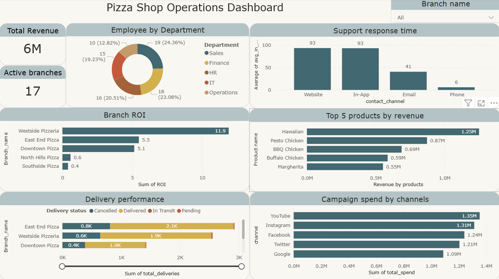

# 🍕 Pizza Shop Operations Analysis

A end-to-end data analysis capstone project analyzing the operations of a multi-branch pizza shop chain using **MySQL** and **Power BI**.

---

## 📊 Dashboard Preview



> 📥 Download the [interactive Power BI dashboard](pizza_shop_dashboard.pbix) to explore the data yourself.

---

## 🗂️ Project Overview

| Detail | Info |
|---|---|
| **Domain** | Food & Beverage / Retail Operations |
| **Tools Used** | MySQL, Power BI |
| **Dataset Size** | 158,839 rows across 12 tables |
| **Project Type** | Capstone Portfolio Project |

---

## 🗃️ Database Schema

The database contains 12 tables covering all aspects of the business:

| Table | Description |
|---|---|
| `branch_data` | Branch locations and investment details |
| `products` | Product catalog with pricing |
| `product_bundles` | Bundle offerings and pricing |
| `orders_info` | Customer order records |
| `deliveries` | Delivery status and timestamps |
| `customers_info` | Customer profiles and signup dates |
| `finance_transactions` | Revenue and payment records |
| `employee_data` | Staff details and employment status |
| `inventory` | Stock levels and expiry tracking |
| `marketing_campaigns` | Campaign performance and spend |
| `customer_support` | Support tickets and response times |
| `assets` | Branch asset details and depreciation |

---

## 🔍 Key Findings

### 1. Westside Pizzeria leads ROI at 11.9x
Among all active branches, Westside Pizzeria delivers the highest return on investment at **11.9x**, significantly ahead of East End Pizza (5.5x) and Downtown Pizza (5.1x). North Hills Pizza and Southside Pizza are underperforming at below 1x ROI and may need operational review.

### 2. Website and In-App support channels are the slowest
Average response times on Website and In-App channels are **467 mins and 465 mins** respectively — far higher than Email (203 mins) and Phone (30 mins). Phone support is clearly the most efficient channel. This is a major operational gap that needs attention.

### 3. Hawaiian pizza is the top revenue driver
Hawaiian pizza generates **1.25M** in revenue, outpacing the next best product Pesto Chicken (0.87M) by a significant margin. The top 5 products are all chicken or classic variants, suggesting customer preference leans toward familiar flavors.

### 4. YouTube and Instagram dominate campaign spend
The business invests most heavily in YouTube (1.35M) and Instagram (1.31M), which aligns with modern digital marketing trends for food businesses targeting younger demographics.

---

## 💡 Business Recommendations

- **Investigate low-ROI branches** — North Hills and Southside Pizza are below 1x ROI. Consider reviewing their cost structure or operational efficiency
- **Improve digital support response times** — Website and In-App channels are critically slow. Adding chatbots or increasing support staff on these channels could significantly improve customer satisfaction
- **Double down on Hawaiian pizza** — It is the clear revenue leader. Featuring it prominently in promotions and bundles could further boost sales
- **Reallocate campaign budget** — Evaluate whether YouTube and Instagram spend is converting to actual orders before increasing budget further

---

## 📂 Repository Structure

```
pizza-shop-analysis/
│
├── README.md                        ← Project documentation
├── pizza_shop_queries.sql           ← All 24 SQL queries
├── dashboard_screenshot.png         ← Dashboard preview image
├── pizza_shop_dashboard.pbix        ← Interactive Power BI file
│
└── data/
    ├── top_products_revenue.csv
    ├── roi_by_branch.csv
    ├── delivery_performance.csv
    ├── employee_by_department.csv
    ├── support_response_time.csv
    └── campaign_spend_efficiency.csv
```

---

## 🧠 SQL Concepts Used

`JOIN` `LEFT JOIN` `GROUP BY` `ORDER BY` `CASE WHEN` `CTE (WITH)` `Window Functions` `RANK()` `DENSE_RANK()` `TIMESTAMPDIFF()` `DATEDIFF()` `ROUND()` `Subqueries` `Aggregate Functions`

---

## 🔗 Connect With Me

[](https://www.linkedin.com/in/yuvan-shankar-j)
[](https://github.com/your-github-username)
